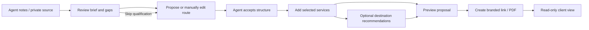

# Agent Studio workflow and API requirements

Agent Studio helps travel agents review client information, agree a route and nights, add requested services, and produce an agency-branded proposal. The agent controls the route and final inclusions. A proposal or imported confirmation does not authorize a reservation.

The UI is available at `/studio` and `/studio/:id`. The earlier consumer itinerary planner remains a separate feature. See [implementation status](IMPLEMENTATION_STATUS.md) for the feature inventory and [verification results](VERIFICATION.md) for dated release evidence.

## Brief review and route planning

Workspace routes shown with `…` are under `/api/studio/workspaces/:id`.

| Requirement                                                                         | Implemented flow / API                                                                                                                                                                                                                     | Limits                                                                                                                                                                                                                                       |
| ----------------------------------------------------------------------------------- | ------------------------------------------------------------------------------------------------------------------------------------------------------------------------------------------------------------------------------------------ | -------------------------------------------------------------------------------------------------------------------------------------------------------------------------------------------------------------------------------------------- |
| Start from agent context, email text, PNR, screenshot, PDF, tour link or dictation. | Free-text composer with **Attach**, **Paste email / PNR**, **Tour link** and **Dictate**. `POST /api/studio/import/preview` extracts editable text for review; `POST …/import` saves the reviewed text privately.                          | PNG/JPEG/WebP/PDF/audio up to 5 MB; text up to 30,000 characters. No mailbox connection or automatic `.eml` ingestion. Files are processed in memory and are not retained as raw attachments.                                                |
| Identify known facts and missing information before generating a route.             | `POST …/review` returns a qualification score, confirmed facts and relevant questions covering dates, travel party, child ages, hotel preferences and output intent.                                                                       | The score measures brief completeness, not accuracy. Unknown facts remain unknown. Review does not search suppliers or generate destination activities.                                                                                      |
| Allow route planning with unanswered qualifying questions.                          | `POST …/structure` accepts `skipQualification: true`; missing information remains visible.                                                                                                                                                 | Skipping qualification does not fabricate dates, passenger counts or prices, and supplier searches still require their mandatory inputs.                                                                                                     |
| Plan the route before services or activities.                                       | Separate conversation and route panels; stop cards show arrival/departure dates, nights, onward transport, neighbourhood and notes. `POST …/structure` proposes the route; `PATCH …` saves manual changes. Chat can request route changes. | Agent Studio does not generate morning/lunch/dinner schedules. Undecided transport is not represented as booked transport. Fixed arrival dates remain explicit.                                                                              |
| Support manual route changes and explicit acceptance.                               | Drag handles, keyboard-friendly move-up/down controls, editable nights and transport. `POST …/accept-structure` enables supplier search and enrichment.                                                                                    | Reordering recomputes dependent dates; conflicts with fixed dates remain for the agent to resolve. Relevant route changes invalidate acceptance and require saving and accepting again. Acceptance approves proposal structure, not booking. |
| Retain useful client context and agency preferences.                                | Private client-name/context history links to earlier workspaces. `GET/PATCH /api/studio/agency` manages agency settings and custom qualifying questions.                                                                                   | New workspaces start with unknown adult/child counts. History is not a full CRM or shared memory across agencies. Settings belong to the current agency/session.                                                                             |

## Services and requested recommendations

| Requirement                                                            | Implemented flow / API                                                                                                                                                                                                            | Limits                                                                                                                                                                                                                                                  |
| ---------------------------------------------------------------------- | --------------------------------------------------------------------------------------------------------------------------------------------------------------------------------------------------------------------------------- | ------------------------------------------------------------------------------------------------------------------------------------------------------------------------------------------------------------------------------------------------------- |
| Review arrangements imported from private sources.                     | After saving a source, explicitly run `POST …/imports/:importId/extract`. Extracted service candidates require review and start excluded. The manual service editor supports externally booked, suggested and placeholder status. | OCR/PNR status remains unverified until reviewed. No automatic booking, ticketing, payment or insurance issuance. Private booking references stay outside client output.                                                                                |
| Search hotels or flights for an accepted route.                        | Service requests use accepted destinations/dates and agent-provided preferences. `POST …/hotels/search` and `POST …/flights/search` return quotes; `POST …/quotes/:quoteId` adds a selected quote.                                | The current LiteAPI configuration uses sandbox inventory, which must remain labelled. A quote does not guarantee availability. Unsupported party/search cases require resolution; adult-only prices cannot substitute for unsupported passenger groups. |
| Request activities or dining for selected destinations.                | `POST …/recommendations` accepts a requested category and destination IDs. It returns small lists of sourced suggestions with include/exclude controls.                                                                           | No automatic enrichment of every stop, fixed time-of-day programme, unsupported accessibility certification or fabricated venue evidence.                                                                                                               |
| Include tour, cruise and transfer details at the agent's chosen level. | Public HTTPS import, PDF/image extraction, and manual service items with dates and descriptions.                                                                                                                                  | Imports do not bypass login, paywall or access restrictions. Internal/metadata addresses, embedded credentials, unsafe redirects and oversized responses are blocked. Agents can instead paste text or attach a screenshot they can access.             |
| Interpret PNR text using the agency's selected format.                 | Agency GDS selection supports auto, Amadeus, Sabre, Galileo or other as a parsing hint.                                                                                                                                           | The format setting does not connect to a GDS, retrieve live PNRs, verify ticketing or enable NDC. Those capabilities need provider-approved APIs and additional implementation.                                                                         |
| Include insurance as an explicit estimate or unpriced item.            | An insurance service item can contain an **agent estimate**, entered amount and notes.                                                                                                                                            | No invented premium formula, coverage guarantee, policy selection, insurer quote claim or issuance. A future quote integration must collect the provider's mandatory traveller inputs.                                                                  |

## Proposal pricing, publication and privacy

The proposal builder supports itemised or package pricing, separate private acquisition costs, margins and payment-cost allowances. These fields support pricing review; there is no automatic customer card fee or law-based surcharge calculator. Package mode hides component sales prices. Branding does not imply that the agency owns or operates third-party services.

Preview and publication use the following workspace routes:

- `GET …/proposal/preview` and `GET …/proposal/preview/pdf` show the private preview.
- `POST …/proposal` explicitly publishes an immutable snapshot.
- `DELETE …/proposal` revokes the published link.
- `GET /api/studio/proposals/:token` and `GET /api/studio/proposals/:token/pdf` serve the public snapshot and PDF.

Public output contains selected proposal details and excludes acquisition costs, internal margins, private sources and PNR references. Client access is read-only: commenting, acceptance, payment and email sending are not implemented. Publishing a link does not send it to anyone.

Agency price validity defaults to 48 hours and is configurable. Supplier quote age can shorten that window; republication cannot make an old supplier quote fresh. After validity ends, the page and PDF remain viewable with reconfirmation messaging. Aged prices are not presented as guaranteed current prices, and the agent can revoke a link explicitly.

## API connections and remaining requirements

| Connection                                         | Implemented use                                                                                                             | Configuration or remaining work                                                                                                                                                                                                                  |
| -------------------------------------------------- | --------------------------------------------------------------------------------------------------------------------------- | ------------------------------------------------------------------------------------------------------------------------------------------------------------------------------------------------------------------------------------------------ |
| OpenAI Responses                                   | Brief review, structure suggestions, private image/PDF extraction, service extraction and sourced optional recommendations. | Server-only `OPENAI_API_KEY` and `OPENAI_MODEL`; requests use `store: false`. Keys are not exposed to the browser. Access and rate limits depend on the configured account.                                                                      |
| OpenAI Audio transcription                         | Opt-in recording or uploaded speech becomes editable text before saving.                                                    | Uses the server key and `gpt-4o-mini-transcribe` through `/v1/audio/transcriptions`. Microphone permission is requested when **Dictate** is selected. Typed input remains available when recording is denied or unsupported.                     |
| LiteAPI                                            | Hotel/flight search and quote candidates.                                                                                   | The current integration uses sandbox mode. Production use needs approved production access and configuration. The existing flight booking flow remains disabled because provider verification has not passed; Agent Studio itself does not book. |
| Additional supplier inventory and flight servicing | No additional connection is implied by importing a document or displaying a quote.                                          | Requires the selected provider's API documentation, credentials, permitted scope, test access and implementation of inventory, fare/ancillary and servicing contracts as applicable.                                                             |
| Live GDS retrieval                                 | The current implementation provides only the parsing hint described above.                                                  | Live retrieval, status verification or ticketing needs an approved provider API, agency/PCC credentials and explicit scope.                                                                                                                      |
| Insurer quotes                                     | Manual estimates remain clearly labelled.                                                                                   | A quote adapter needs approved API access, product rules and mandatory traveller inputs. It must preserve the returned product, assumptions, timestamp and terms.                                                                                |

The OpenAI implementation follows the official [file input guide](https://developers.openai.com/api/docs/guides/file-inputs), [image input guide](https://developers.openai.com/api/docs/guides/images-vision), and [file transcription guide](https://developers.openai.com/api/docs/guides/speech-to-text). Source content is treated as untrusted data, not as instructions to publish, change a route or make a reservation. See [integration configuration](INTEGRATIONS.md) for environment variables and provider setup.

## Acceptance examples

1. Enter a fictional request for Paris, Amsterdam and London in November for two adults and two children, asking for a route only. Review identifies missing exact dates and child ages; no hotel or activity generation starts.
2. Supply dates, nights and child ages or explicitly skip qualification. Reorder the stops and adjust nights. Save changes and accept the structure.
3. Paste a fictional PNR or upload a fictional screenshot. Preview and correct the text. Saving adds a private source; **Extract arrangements** creates excluded candidates for review after structure acceptance.
4. Request hotels for one accepted destination or add an externally booked service. Selecting an item includes it in the proposal without invoking a booking endpoint.
5. Request vegetarian dining suggestions for one destination. Only that category and location are enriched, with sources and no time-of-day itinerary.
6. Add an insurance estimate and package price. Preview the proposal and verify that costs, margins, source text and private booking references are absent.
7. Create a link and download the PDF. The client sees a read-only snapshot with price validity. After validity ends, reconfirmation messaging appears while the proposal remains accessible. Revoking the link removes public access.
