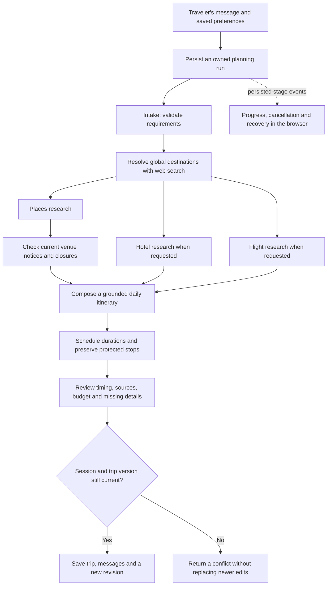

# Asktara itinerary system

This is Asktara's own implementation of the publicly observable travel-planning workflow. Odessia's public destination guides expose timed itinerary templates and linked place details; personalized generation requires authentication. Its prompts, private services, and agent architecture were not accessible. See [the inspection evidence](ITINERARY_RESEARCH.md).

## How a request becomes a trip

The workflow is explicitly coordinated TypeScript code. With an OpenAI key, GPT-6 Astra Responses calls perform conversational intake, live web research, independent venue-status verification, and grounded composition. Research requires a completed web-search tool call and actual source URLs; model-invented URLs cannot become evidence. Destination allocation, supplier tools, scheduling, validation, and persistence remain application-controlled. Without the key, deterministic parsing and curated scheduling perform the same workflow. The interface identifies curated mode; local stages are not claimed to be independent language models.

The engine entry point is `server/agents/index.ts`. Shared input, event, result, report, and run contracts live in `shared/planning.ts`. `server/run-manager.ts` manages background work; `server/database.ts` persists trips, events, run states, and version snapshots in SQLite. The frontend follows server events by polling, rather than displaying a timer with simulated progress.

## Agent and tool responsibilities

| Stage        | Responsibility                                                                                                                               | External capability                                      |
| ------------ | -------------------------------------------------------------------------------------------------------------------------------------------- | -------------------------------------------------------- |
| Intake       | Extract destination, dates, duration, travelers, budget, pace, route, and stated preferences. Preserve existing requirements unless changed. | Optional OpenAI structured Responses call                |
| Destinations | Resolve city/country identity and coordinates worldwide; preserve route order and clarify ambiguity.                                         | OpenAI Responses web search                              |
| Places       | Ground suggestions in curated places or provider search results. Track source, address, duration allowance, and available published hours.   | OpenAI web search; optional Google Places API (New)      |
| Stays        | Research requested dates and occupancy when the traveler supplies required nationality and hotel research is enabled.                        | Optional LiteAPI rates                                   |
| Flights      | Search explicitly requested airport pairs and dates. Never infer nationality or a home airport.                                              | LiteAPI using the same hotel key; optional Duffel        |
| Itinerary    | Select grounded places, assign practical time blocks, leave room for meals and travel, and preserve protected stops.                         | Optional OpenAI composition plus deterministic scheduler |
| Review       | Check schedule, geographic concerns, duplicate visits, protected items, budget coverage, and missing information.                            | Application validation                                   |

Supplier research is run only when required inputs exist. Missing keys, missing fields, test data, and provider failures remain visible in the report. Source records distinguish curated ideas, provider data, test results, and user choices. Hotel examples are fictional inspiration. No model is allowed to manufacture provider prices or booking confirmations.

Multiple researched destinations can be allocated through trip settings. Transfer days reserve time explicitly; an assumed travel block is not a verified connection. Opening hours, estimated movement time, and a sensible schedule are not a guarantee that a venue will be open or a route feasible on a future date. The thirteen featured destinations remain an editorial collection. AI planning uses per-trip destination snapshots, so new cities work in saved itineraries, route settings, hotel coordinate searches, maps, calendar exports and shared copies without changing the global catalog. Public snapshots contain destination identity; private preferences stay in the trip brief.

## State, interruption, and edits

The browser starts a run with a unique request ID. The backend scopes that ID to the current owner, prevents concurrent runs for the same trip, and persists progress. Refreshing a trip page loads its saved trip and active run. Repeating the same request ID returns the existing run instead of creating another trip.

Cancellation uses an `AbortController` through model and supplier requests. A cancelled or failed run does not install a partial itinerary. An interrupted process marks unfinished persisted runs as failed on startup so the user can retry. This is a single-instance background runner, not a distributed durable queue.

Each run remembers the trip revision it started from. The final commit checks both ownership/session validity and revision. Newer user edits win. Signing out, changing the authenticated session, deleting a trip, or changing a trip while it is being planned cannot cause a stale result to restore removed data.

Editing or adding a stop protects it from subsequent planning. The traveler can explicitly unlock it. Protected activities retain their IDs, days, times, and content. Shortening a trip past a protected day requires first moving or unlocking the stop. Earlier itinerary versions are restorable; restoring creates a new version and preserves current conversation and sharing settings.

Public sharing exposes the itinerary and basic trip information. It omits conversation, account details, the private research brief, and the full research report. Share tokens remain revocable, including while planning is in progress.

## HTTP contract

All routes require the current session cookie. A new client should call `GET /api/session` before parallel requests.

| Endpoint                                            | Request / result                                                                                     |
| --------------------------------------------------- | ---------------------------------------------------------------------------------------------------- |
| `POST /api/planning/runs`                           | `{ requestId, message, tripId?, brief? }` → HTTP 202 `{ run }`                                       |
| `GET /api/planning/runs/:id`                        | `{ run }`, including stage events and terminal result/error                                          |
| `POST /api/planning/runs/:id/cancel`                | `{ run }`                                                                                            |
| `GET /api/trips/:id/runs`                           | `{ runs }` for the owned trip                                                                        |
| `PATCH /api/trips/:id`                              | Editable trip fields, optional `brief`, itinerary, and `revision` concurrency guard → `{ trip }`     |
| `GET /api/trips/:id/places/:placeId`                | Fresh Google place details for a place referenced by the owned trip → `{ place }`; no-store response |
| `POST /api/shared/:token/clone`                     | Create an independent private trip from the public itinerary → `{ trip }`; no additional AI request  |
| `GET /api/trips/:id/revisions`                      | `{ revisions }` metadata                                                                             |
| `POST /api/trips/:id/revisions/:revisionId/restore` | `{ revision: currentVersion }` → `{ trip }`                                                          |
| `POST /api/chat`                                    | Compatibility endpoint using the same workflow, returning the completed result synchronously         |

The report includes missing-detail questions, assumptions, source records, researched places/stays/flights, issues, and a group budget breakdown. Activity costs are per person; group totals multiply them by the traveler count. Unpriced transport or other costs are listed separately. Calendar export uses each stop's duration and destination-local wall-clock dates.

## Operating boundary

Use one persistent application instance with the included SQLite store. Multiple replicas require shared run coordination, database storage, and rate limits. The configured LiteAPI account intentionally remains in sandbox mode. Live web research is separate from simulated supplier inventory. The adapters implement search and planning; checkout, ticketing, confirmed reservations, direct calendar sync, email verification/recovery, and operations for a public launch remain separate work. Adding keys does not implement those missing workflows.

Google Places research is transient. A persistence sanitizer removes Google-supplied names, addresses, coordinates, hours, and derived content from saved trips, run results, and revisions; place IDs and application-authored planning allowances remain. The owner-only place-detail endpoint retrieves fresh data for the displayed day or details dialog. The browser holds this content only in page state, and responses use `Cache-Control: no-store`. Public shared plans show stored planning labels rather than copying live place content. Confirm attribution and any future storage changes against the [official Places policies](https://developers.google.com/maps/documentation/places/web-service/policies) before deployment.

## Global concierge implementation

`server/agents/openai.ts` centralizes server-side Responses requests, GPT-6 Astra model selection, reasoning, structured-output validation, cancellation, timeouts and safe error handling. `models.ts` extracts a free-form destination request rather than a catalog enum. `research.ts` requires live web search and validates facts against returned source URLs before creating places. The composition specialist receives those places, preferences and supplier results; it cannot invent itinerary place IDs. A separate forced-web verifier checks operating notices before composition, excludes evidenced closures during the trip window, and records uncertainty where current operation cannot be established. Protected stops remain protected with a specific closure warning.

Planning, discovery, clarification and informational answers are distinct intents. Discovery presents researched choices without selecting a destination for the traveler. Questions about an existing trip preserve its schedule. Failures during intake or research leave the saved itinerary intact. The run has a six-minute total deadline, with bounded individual model and supplier calls.

`shared/destinations.ts` resolves featured and trip-scoped identities. A client can reference a researched ID but cannot upload arbitrary destination metadata through trip patch or hotel-search endpoints. `POST /api/hotels/search` accepts an optional owned `tripId`; the server resolves the city coordinates before calling LiteAPI. Both flight and hotel adapters preserve sandbox labels. Test prices are excluded from the trip's live cost total, and unpriced components remain visible.

Manual changes invalidate supplier offers while preserving source records behind saved places. Model changes still pass protected-stop and version checks. Citation links are displayed as escaped text and safe HTTP(S) anchors; no model-authored HTML is executed.

Official API references: [GPT-6 Astra](https://developers.openai.com/api/docs/models/gpt-6-astra), [Responses web search](https://developers.openai.com/api/docs/guides/tools-web-search), [LiteAPI hotel rates](https://docs.liteapi.travel/reference/post_hotels-rates).
